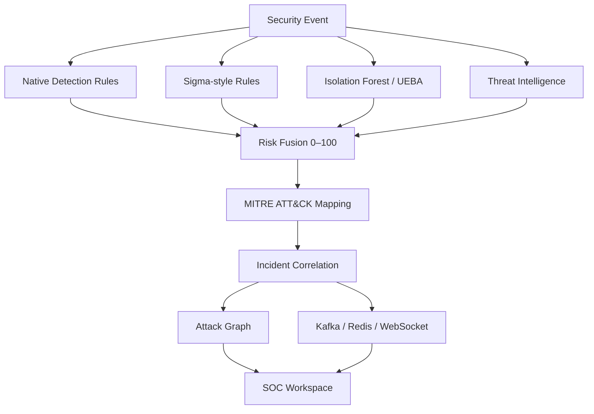
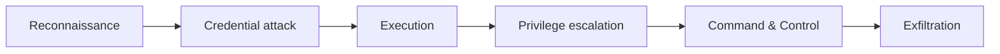
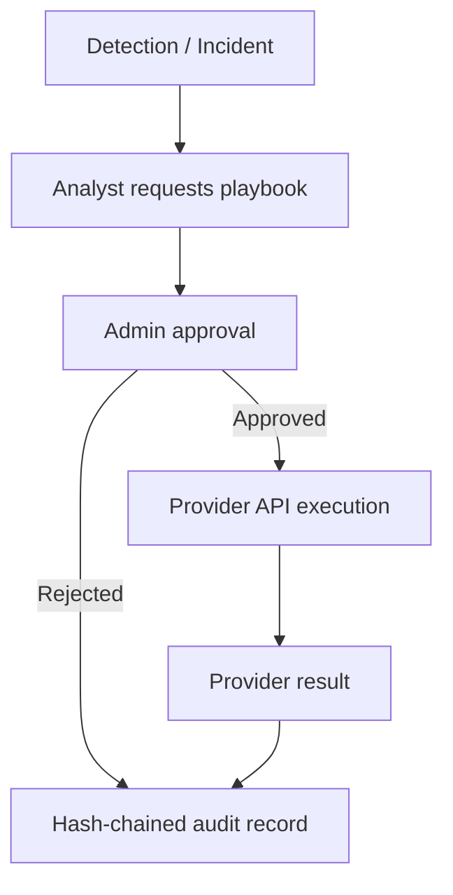
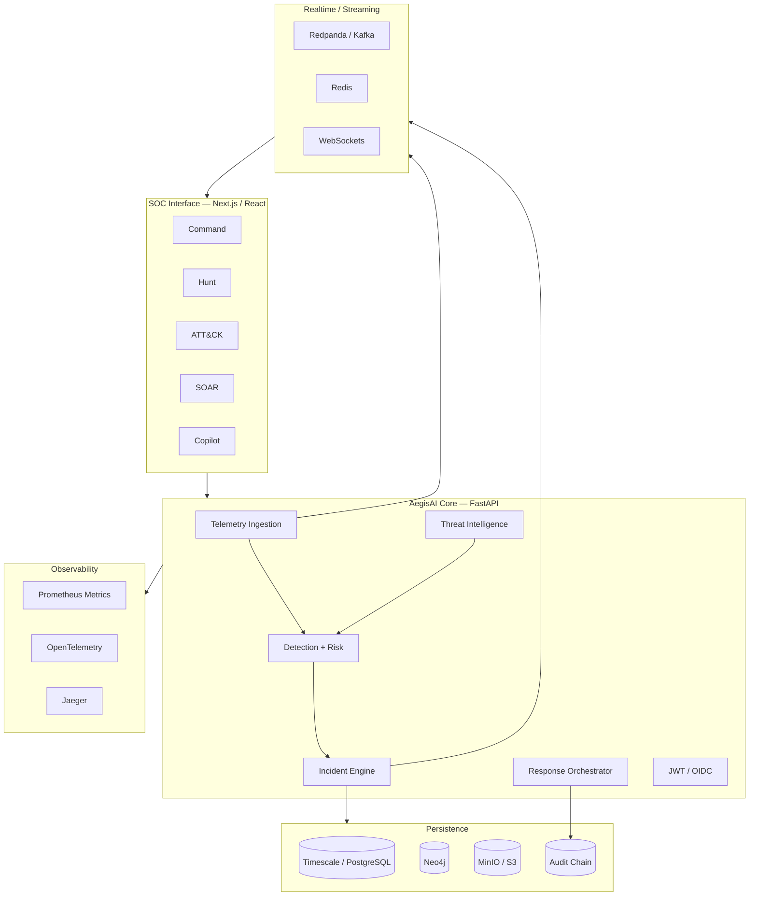

<div align="center">

# AegisAI

### Enterprise AI-powered Security Operations, Detection Engineering and Automated Defensive Response

**AegisAI is a full-stack cyber-defence platform that combines SIEM telemetry, UEBA anomaly detection, Sigma-style rules, MITRE ATT&CK intelligence, incident correlation, graph investigations, threat-intelligence ingestion, evidence integrity and approval-gated SOAR response in one operational SOC workspace.**


[Live Deployment](#live-deployment) · [Architecture](#system-architecture) · [Detection Engine](#detection-and-risk-engine) · [SOC Workflows](#security-operations-workflows) · [Integrations](#enterprise-integrations) · [Run Locally](#running-locally)

</div>

---

## What is AegisAI?

Modern security teams rarely suffer from a lack of telemetry. They suffer from fragmentation.

Network events arrive through one system. Endpoint detections appear in another. Threat intelligence lives somewhere else. Analysts manually reconstruct attack paths, correlate alerts, gather evidence and then switch tools again to contain an endpoint, revoke an identity session or block a malicious source.

AegisAI explores a different model: **one security context from ingestion to investigation to defensive response**.

The platform is designed around an end-to-end SOC flow:

```text
Security telemetry
      ↓
Normalization
      ↓
Rules + Sigma + UEBA
      ↓
Threat-intelligence enrichment
      ↓
Risk fusion
      ↓
MITRE ATT&CK mapping
      ↓
Incident correlation
      ↓
Attack graph reconstruction
      ↓
Analyst investigation
      ↓
Approval-gated defensive response
      ↓
Immutable audit trail
```

AegisAI is not intended to be a decorative cybersecurity dashboard. The backend contains real event ingestion, persistence, streaming, correlation, evidence storage and provider integration paths.

---

# Live Deployment

AegisAI Enterprise v1.0 is deployed as a split production stack with the Next.js SOC interface on **Vercel** and the FastAPI security engine on **Render**.

| Component | Production endpoint | Status |
|---|---|---|
| **SOC Dashboard** | [aegis-ai-tau-orpin.vercel.app](https://aegis-ai-tau-orpin.vercel.app) | Live |
| **FastAPI backend** | [aegis-ai-api-ulca.onrender.com](https://aegis-ai-api-ulca.onrender.com) | Live |
| **Swagger / OpenAPI** | [API documentation](https://aegis-ai-api-ulca.onrender.com/docs) | Live |
| **Health endpoint** | [`/health`](https://aegis-ai-api-ulca.onrender.com/health) | Live |
| **PostgreSQL 16** | Render managed database | Provisioned |
| **Redis / Key Value** | Render managed instance | Provisioned |

The production deployment is connected to the GitHub `main` branch, so repository updates can automatically trigger new builds.

```text
GitHub / main
      │
      ├──────────────► Vercel
      │                 │
      │                 └── Next.js SOC Dashboard
      │
      └──────────────► Render
                        │
                        └── FastAPI Detection & Response API
```

The frontend is configured with:

```text
NEXT_PUBLIC_API_URL=https://aegis-ai-api-ulca.onrender.com
```

Production CORS is configured for the Vercel deployment while retaining localhost support for development.

### Current cloud-infrastructure state

The public deployment intentionally fails closed for integrations that do not yet have real provider credentials.

| Capability | Cloud state |
|---|---|
| Core FastAPI SOC API | Active |
| Next.js command center | Active |
| JWT analyst/admin authentication | Active |
| Prometheus endpoint | Active |
| PostgreSQL 16 | Provisioned; application connection still requires the managed `DATABASE_URL` to be attached |
| Redis | Provisioned; application connection still requires `REDIS_URL` and `REDIS_ENABLED=true` |
| Kafka / Redpanda | Disabled in the public Render deployment |
| Neo4j | Disabled in the public Render deployment |
| OpenTelemetry / Jaeger | Disabled in the public Render deployment |
| MISP | Requires real MISP endpoint/API key |
| TAXII/STIX | Requires real TAXII collection credentials |
| Cloudflare SOAR | Requires real Cloudflare credentials |
| CrowdStrike SOAR | Requires real CrowdStrike credentials |
| Microsoft Graph SOAR | Requires real Microsoft identity credentials |

No external provider is reported as successfully executing unless it is actually configured and the provider API confirms the action.

> **Deployment note:** Render's free web service is suitable for portfolio/demo operation and may cold-start after inactivity. The local Docker Compose stack remains the most complete all-in-one environment because it starts PostgreSQL/TimescaleDB, Redis, Redpanda, MinIO, Neo4j and Jaeger together.

---

# Security Operations Platform

The frontend provides dedicated operational workspaces rather than placing every capability into one dashboard.

| Workspace | Purpose |
|---|---|
| **Command** | Live SOC overview, detections, incidents and security posture |
| **Hunt** | Entity, event and telemetry investigation |
| **ATT&CK** | MITRE technique coverage, tactic progression and adversary context |
| **SOAR** | Defensive playbooks, approval queue and provider execution results |
| **Copilot** | Natural-language investigation and SOC query assistance |

The command center exposes live operational signals including:

- total telemetry volume
- active and critical incidents
- high-risk detections
- severity distribution
- entity risk
- MITRE ATT&CK technique activity
- country/origin activity
- active incident timelines
- response-action status
- infrastructure health
- WebSocket connection state

---

# Core capabilities

| Capability | Implementation |
|---|---|
| **Event ingestion** | FastAPI security-event ingestion API |
| **Realtime stream** | WebSockets, Redis pub/sub and Kafka-compatible Redpanda |
| **Rule detection** | Native behavioural/security detections |
| **Sigma** | YAML-based Sigma-style detection layer |
| **UEBA** | Isolation Forest anomaly scoring |
| **Risk fusion** | Rules + anomaly + IOC intelligence → unified 0–100 risk score |
| **MITRE ATT&CK** | Technique and kill-chain context attached to detections |
| **Incident correlation** | Multi-event grouping and timeline reconstruction |
| **Entity risk** | IP, host and user risk aggregation |
| **Attack graph** | Source → event → target → ATT&CK relationships |
| **Threat intelligence** | Runtime IOC registry with MISP and TAXII/STIX ingestion |
| **Threat hunting** | Structured event/entity hunting APIs and UI |
| **SOC Copilot** | Natural-language investigation/query layer |
| **Evidence vault** | Binary object storage with SHA-256 integrity metadata |
| **Audit chain** | Append-only hash-linked audit records with verification |
| **Authentication** | JWT sessions plus OIDC token verification support |
| **Authorization** | Analyst/admin defensive-action controls |
| **SOAR** | Approval-gated defensive response provider adapters |
| **Observability** | Prometheus metrics + OpenTelemetry + Jaeger |
| **Persistence** | Timescale/PostgreSQL state hydration and durable records |

---

# Detection and risk engine

Every security event enters a multi-stage detection pipeline.



## Native detections

The built-in engine can identify patterns such as:

- brute-force authentication behaviour
- reconnaissance and port scanning
- suspicious remote-access/service ports
- PowerShell and living-off-the-land activity
- known dual-use or offensive tooling indicators
- privilege-escalation behaviour
- malware-related activity
- command-and-control indicators
- suspicious large outbound transfers / exfiltration signals

Detection logic is deliberately modular so additional rules can be introduced without replacing the whole pipeline.

---

## Sigma-style detection

Rules can be defined outside the Python detection engine in YAML.

```text
backend/rules/sigma_rules.yml
```

This separates security content from application code and creates a foundation for a larger detection engineering workflow.

A matched Sigma rule contributes to:

```text
Detection context
Risk score
Severity
MITRE ATT&CK mapping
Incident correlation
Analyst explanation
```

---

## UEBA / anomaly detection

AegisAI uses an Isolation Forest layer to identify behavioural outliers that may not match a deterministic rule.

The anomaly layer contributes its own score to the final risk calculation rather than replacing explicit detection logic.

```text
Rule evidence       ┐
Sigma evidence      │
Behaviour anomaly   ├──► Risk fusion ──► 0–100 score
Threat intelligence │
Event context       ┘
```

This hybrid model avoids treating machine learning as a universal security oracle.

---

# Threat intelligence

AegisAI maintains a runtime IOC registry that can influence subsequent detection decisions.

Supported real feed paths include:

- **MISP** attribute synchronization
- **TAXII 2.1 / STIX** collection synchronization
- local IOC enrichment

Threat intelligence can increase the confidence/risk attached to observed indicators such as malicious IPs and other supported observables.

### MISP

The integration path uses MISP's REST interface for attribute retrieval and imports compatible indicators into the runtime registry.

### TAXII / STIX

AegisAI can retrieve STIX objects from a configured TAXII collection and extract supported cyber observables for matching.

When integrations are not configured, they fail clearly instead of fabricating threat-intelligence results.

---

# MITRE ATT&CK intelligence

Detections can carry MITRE technique context so analysts see *what adversary behaviour the event represents*, not only its severity.

Examples include mappings such as:

```text
T1110  Brute Force
T1046  Network Service Discovery
T1059  Command and Scripting Interpreter
```

The ATT&CK workspace provides:

- technique frequency
- active technique coverage
- tactic progression
- incident-level technique aggregation
- attack-graph linkage

This context is also used by incident reports and investigation workflows.

---

# Incident correlation

A single high-risk event is useful. A reconstructed campaign is more useful.

AegisAI groups related detections into incidents and builds a timeline of attacker behaviour.



Incident state supports:

```text
Open
Investigating
Contained
Closed
```

Analysts can also attach:

- notes
- evidence metadata
- binary evidence files
- response actions
- generated incident reports

---

# Graph-based investigation

AegisAI can persist investigation relationships to **Neo4j**.

The graph model links security entities such as:

```text
Source IP
   ↓
Security Event
   ↓
Target Host / User
   ↓
MITRE Technique
   ↓
Incident
```

This makes multi-stage relationships easier to explore than a flat event table.

The local Neo4j Browser is exposed by the Docker stack for graph inspection.

---

# Security operations workflows

## Live investigation

An analyst can open a telemetry event and inspect:

- risk score
- severity
- source and destination
- username / hostname context
- anomaly percentage
- detection confidence
- matched rules
- Sigma matches
- IOC enrichment
- MITRE techniques
- recommended analyst actions

## Entity hunting

AegisAI aggregates security activity around:

```text
Source IPs
Destination systems
Users
Hosts
Sensors
Event types
```

The hunting layer enables analysts to pivot from a detection to the broader entity context rather than manually searching individual records.

## Structured hunt queries

The backend exposes a hunting endpoint for filtered investigation against the normalized security-event model.

This complements the interactive Hunt workspace and Copilot interface.

---

# Aegis Copilot

Aegis Copilot provides a natural-language layer over security operations data.

Example investigation prompts:

```text
Show critical credential incidents from outside the UK.

Which source IPs have the highest current risk?

Show activity associated with credential attacks.

What MITRE techniques are currently most active?
```

The Copilot layer is designed as an interface to structured security context—not as an autonomous authority for destructive infrastructure actions.

---

# SOAR and defensive response

AegisAI includes real provider execution paths for approved defensive actions.



Current provider-adapter paths include:

### Cloudflare

Used for approved malicious source-IP blocking when Cloudflare credentials and zone/account configuration are present.

### CrowdStrike

Used for approved endpoint containment when the CrowdStrike provider is configured.

### Microsoft Graph

Used for approved identity session revocation when Microsoft Graph credentials and identity context are configured.

### Fail-closed execution

AegisAI does not report a successful response when a provider is missing or rejects the operation.

The resulting action records the real provider result/error for analyst review and auditing.

---

# Evidence integrity

Incident evidence can be written to an S3-compatible object store through **MinIO**.

For each uploaded evidence object AegisAI can retain:

- object reference
- incident association
- filename / metadata
- content SHA-256 hash

This creates a foundation for evidence provenance and later chain-of-custody workflows.

---

# Tamper-evident audit chain

Security automation should itself be auditable.

AegisAI therefore maintains an append-only audit structure in which entries include the previous record's hash.

```text
Record 1
 hash: A

Record 2
 previous_hash: A
 hash: B

Record 3
 previous_hash: B
 hash: C
```

The backend exposes audit verification so the chain can be checked for modification.

This is **tamper-evident**, not a claim of mathematically immutable infrastructure.

---

# Authentication and authorization

AegisAI supports:

- local JWT sessions
- analyst/admin role separation
- OIDC token exchange/verification
- configurable issuer, audience and JWKS endpoint

Sensitive response workflows are restricted by role.

The intended operating model is:

```text
Analyst
├── investigate
├── hunt
├── document incident
└── request response

Administrator
├── review response
├── approve/reject
└── execute configured provider action
```

Development credentials are provided only for local demonstration and must be changed before any shared or internet-accessible deployment.

---

# System architecture



---

# Infrastructure stack

When launched through Docker Compose, the project can run the following services:

| Service | Port | Role |
|---|---:|---|
| **AegisAI Dashboard** | `3000` | SOC interface |
| **FastAPI Core** | `8000` | detection, incidents, APIs |
| **Timescale/PostgreSQL** | `5432` | durable event/incident storage |
| **Redis** | `6379` | realtime pub/sub |
| **Redpanda** | `9092` | Kafka-compatible telemetry streaming |
| **MinIO API** | `9000` | evidence object storage |
| **MinIO Console** | `9001` | object-store administration |
| **Neo4j Browser** | `7474` | graph investigation |
| **Jaeger** | `16686` | distributed tracing |

---

# Observability

AegisAI instruments its own platform rather than treating SOC infrastructure as a black box.

### Prometheus-compatible metrics

```text
GET /api/v1/metrics
```

### OpenTelemetry

API operations can emit traces through an OpenTelemetry pipeline.

### Jaeger

The Compose stack includes Jaeger for local trace inspection.

This means the SOC can be debugged as a distributed system—not only used as a security UI.

---

# API surface

AegisAI exposes a broad REST/WebSocket surface through FastAPI and OpenAPI.

Key routes include:

```text
POST   /api/v1/auth/login
POST   /api/v1/auth/oidc/exchange

POST   /api/v1/events
GET    /api/v1/events

GET    /api/v1/incidents
GET    /api/v1/incidents/{id}
PATCH  /api/v1/incidents/{id}/status
POST   /api/v1/incidents/{id}/notes
POST   /api/v1/incidents/{id}/evidence

GET    /api/v1/hunting/entities
GET    /api/v1/hunting/attack-heatmap
GET    /api/v1/hunting/geo-activity
GET    /api/v1/hunting/attack-graph/{incident_id}
POST   /api/v1/hunting/query

GET    /api/v1/intelligence/overview
POST   /api/v1/copilot/query

GET    /api/v1/response/playbooks
GET    /api/v1/response/actions
POST   /api/v1/response/actions
POST   /api/v1/response/actions/{id}/approve
POST   /api/v1/response/actions/{id}/reject

POST   /api/v1/enterprise/feeds/misp/sync
POST   /api/v1/enterprise/feeds/taxii/sync
POST   /api/v1/enterprise/incidents/{id}/evidence-file
GET    /api/v1/enterprise/audit
GET    /api/v1/enterprise/audit/verify

GET    /api/v1/analytics/summary
GET    /api/v1/system/status
GET    /api/v1/system/trend
GET    /api/v1/system/coverage

WS     /api/v1/ws/events
```

Full interactive documentation is available at:

```text
http://localhost:8000/docs
```

---

# Enterprise integrations

AegisAI intentionally separates an integration being **implemented** from that integration being **configured**.

| Integration | Purpose | Behaviour when not configured |
|---|---|---|
| MISP | IOC feed ingestion | Sync fails clearly |
| TAXII/STIX | Threat intelligence ingestion | Sync fails clearly |
| MinIO/S3 | Evidence objects | Upload reports storage error |
| Neo4j | Investigation graph | Core SOC remains available where possible |
| OIDC | Enterprise authentication | Local JWT remains available |
| Cloudflare | Source-IP defensive control | Response remains unexecuted |
| CrowdStrike | Endpoint containment | Response remains unexecuted |
| Microsoft Graph | Identity session revocation | Response remains unexecuted |

No integration is represented as successful merely because its UI exists.

---

# Running locally

## Requirements

Install:

```text
Docker Desktop
Docker Compose
Git
```

For Windows, Docker Desktop should be using the WSL 2 backend.

## 1. Clone

```bash
git clone https://github.com/Edgar-50/Aegis_Ai.git
cd Aegis_Ai
```

## 2. Create environment configuration

### Windows PowerShell

```powershell
Copy-Item .env.example .env
```

### macOS / Linux

```bash
cp .env.example .env
```

Open `.env` and change the development secrets before any non-local deployment.

## 3. Launch the stack

```bash
docker compose up --build
```

The initial build can take longer because Docker must download Python, Node.js and service images and install dependencies.

## 4. Open the platform

```text
SOC Dashboard
http://localhost:3000

FastAPI / OpenAPI
http://localhost:8000/docs

Health
http://localhost:8000/health

MinIO Console
http://localhost:9001

Neo4j Browser
http://localhost:7474

Jaeger
http://localhost:16686
```

---

# Local development accounts

The local development build includes demo analyst/admin credentials for exercising authorization workflows.

These are **development-only identities** and should never be retained for a public deployment.

Check `.env.example` and the authentication configuration before launching the project outside a local environment.

---

# Repository structure

```text
Aegis_Ai/
│
├── backend/
│   ├── app/
│   │   ├── api/
│   │   │   ├── analytics.py
│   │   │   ├── auth.py
│   │   │   ├── copilot.py
│   │   │   ├── enterprise.py
│   │   │   ├── events.py
│   │   │   ├── hunting.py
│   │   │   ├── incidents.py
│   │   │   ├── intelligence.py
│   │   │   ├── metrics.py
│   │   │   ├── reports.py
│   │   │   ├── response.py
│   │   │   ├── system.py
│   │   │   └── websocket.py
│   │   │
│   │   ├── core/
│   │   │   ├── auth.py
│   │   │   ├── config.py
│   │   │   └── database.py
│   │   │
│   │   ├── models/
│   │   └── services/
│   │       ├── anomaly.py
│   │       ├── audit.py
│   │       ├── bus.py
│   │       ├── detection.py
│   │       ├── evidence_store.py
│   │       ├── graphdb.py
│   │       ├── incidents.py
│   │       ├── integrations.py
│   │       ├── kafka_ingest.py
│   │       ├── pipeline.py
│   │       ├── sigma.py
│   │       ├── threat_intel.py
│   │       └── websocket.py
│   │
│   ├── rules/
│   │   └── sigma_rules.yml
│   ├── tests/
│   ├── Dockerfile
│   └── requirements.txt
│
├── frontend/
│   ├── app/
│   │   ├── layout.tsx
│   │   ├── page.tsx
│   │   └── styles.css
│   ├── Dockerfile
│   ├── package.json
│   └── tsconfig.json
│
├── data/
├── docs/
├── docker-compose.yml
├── .env.example
└── README.md
```

---

# Verification status

The consolidated backend regression suite covers core detection and enterprise behaviour.

```text
11 backend tests passing
```

The verified areas include detection behaviour, authentication foundations, Sigma/threat-intelligence escalation, entity risk, graph generation and response workflow logic.

The final package was also checked for Python compilation and Docker Compose structure.

> The original build environment could not complete the final remote npm dependency download because of a network timeout. The frontend Dockerfile installs and builds dependencies as part of the local Docker build.

See `FINAL_VERIFICATION.txt` for the release verification note.

---

# Security model and boundaries

AegisAI is designed for defensive security engineering.

### 1. Response actions require explicit authorization

Infrastructure-changing operations are not exposed as arbitrary remote command execution.

### 2. Provider integrations fail closed

Missing credentials or provider failures do not become fake successful actions.

### 3. Analysts and administrators have different authority

Investigation and execution are intentionally separated.

### 4. Evidence integrity is verifiable

SHA-256 metadata is used to identify modifications to stored evidence objects.

### 5. Audit history is tamper-evident

The hash chain makes modification detectable, but is not marketed as magically immutable storage.

### 6. AI does not replace deterministic security controls

Anomaly models and Copilot features augment—not replace—explicit rules, authorization and provider controls.

### 7. Demo telemetry remains identifiable as demo telemetry

The included SOC scenario generator is intended to exercise the detection pipeline during development.

---

# Engineering principles

```text
Detection evidence > unexplained scores

Correlation > isolated alerts

Threat context > raw telemetry

Human approval > silent destructive automation

Fail closed > fake successful integrations

Persistence > dashboard-only state

Graph relationships > flat incident lists

Auditability > invisible automation

Observability > black-box infrastructure

Explicit limitations > inflated claims
```

---

# Why I built it

AegisAI is an engineering study in what happens when multiple cybersecurity disciplines are treated as one system rather than separate portfolio demos.

The project combines:

- security operations engineering
- detection engineering
- anomaly detection / machine learning
- threat intelligence
- MITRE ATT&CK modelling
- event-driven architecture
- distributed systems
- graph databases
- evidence integrity
- identity and access control
- security automation
- full-stack application development
- realtime systems
- observability
- containerized infrastructure

The interesting problem is not creating another alert table.

It is preserving context across the complete path:

```text
Why was this event suspicious?
        ↓
What else is related to it?
        ↓
Which ATT&CK behaviour does it represent?
        ↓
Which user/host/source is accumulating risk?
        ↓
Does this belong to an active incident?
        ↓
What evidence supports the investigation?
        ↓
What defensive action is justified?
        ↓
Who approved it?
        ↓
What did the external provider actually return?
        ↓
Can the entire sequence be audited later?
```

AegisAI is designed around that chain of context.

---

# Project boundaries

AegisAI deliberately distinguishes between engineering capability and production assurance.

| Engineering concept | Not equivalent to |
|---|---|
| Working SIEM pipeline | Certified commercial SIEM |
| Isolation Forest anomaly score | Proof of malicious behaviour |
| Threat-intelligence match | Attribution |
| MITRE mapping | Complete adversary reconstruction |
| Hash-chained audit data | Legally immutable storage |
| Docker deployment | Production security hardening |
| Provider API adapter | Authorization to act on a third-party environment |
| Demo SOC scenario | Real attack evidence |
| AI-assisted hunting | Autonomous security authority |

Production deployment would additionally require organization-specific access controls, secrets management, threat modelling, provider scopes, network segmentation, monitoring, backups, incident procedures and independent security validation.

---

# Testing

Backend tests are located under:

```text
backend/tests/
```

Run locally with:

```bash
cd backend
python -m pytest -q
```

---

# Contributing

Technical feedback and structured contributions are welcome.

Particularly useful areas include:

```text
Detection engineering
Sigma rule coverage
Threat-intelligence normalization
ATT&CK mappings
UEBA evaluation
Graph investigation UX
SIEM query language
SOAR provider adapters
Authentication hardening
Evidence provenance
Observability
Performance testing
Frontend accessibility
Automated testing
```

---

# Author

**Edgar Charles Omondi**

Computer Science · AI/ML · Cybersecurity Engineering · Full-Stack & Distributed Systems

GitHub: [@Edgar-50](https://github.com/Edgar-50)

---

<div align="center">

## AegisAI

**Detect. Correlate. Investigate. Respond. Audit.**

[Repository](https://github.com/Edgar-50/Aegis_Ai) · [Architecture](#system-architecture) · [Run Locally](#running-locally)

<br />

<sub>
Defensive security engineering project · Provider actions require explicit configuration and authorization
</sub>

</div>
